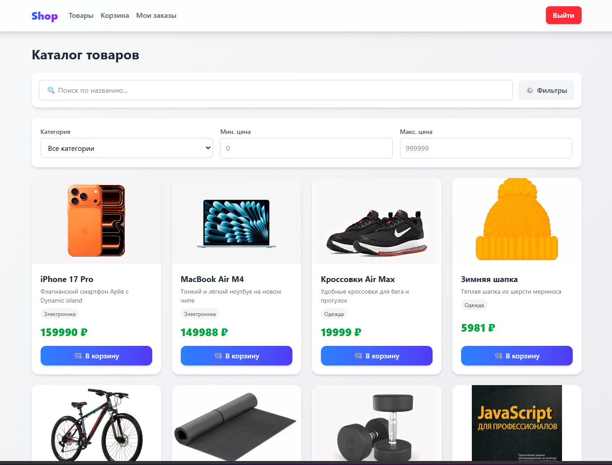
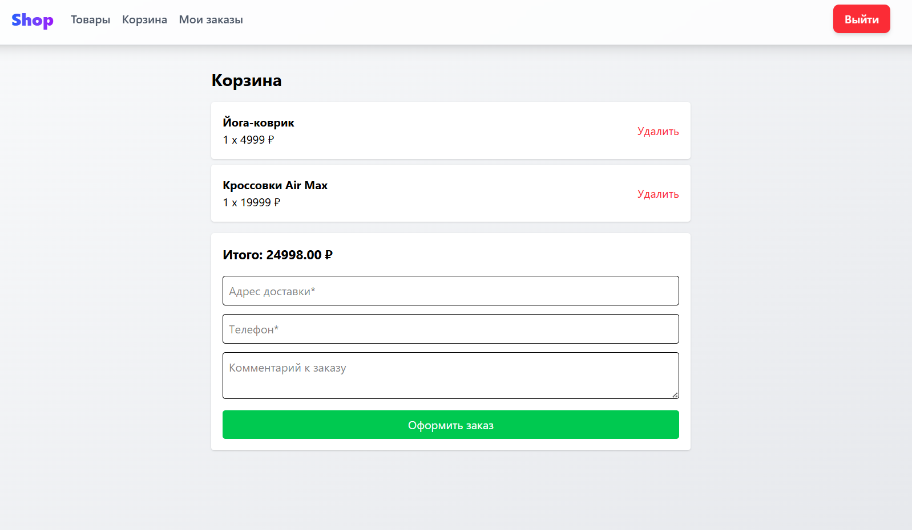
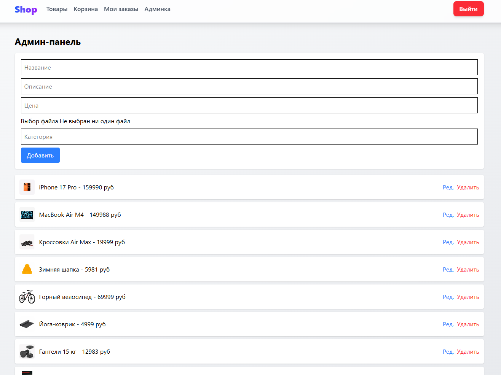
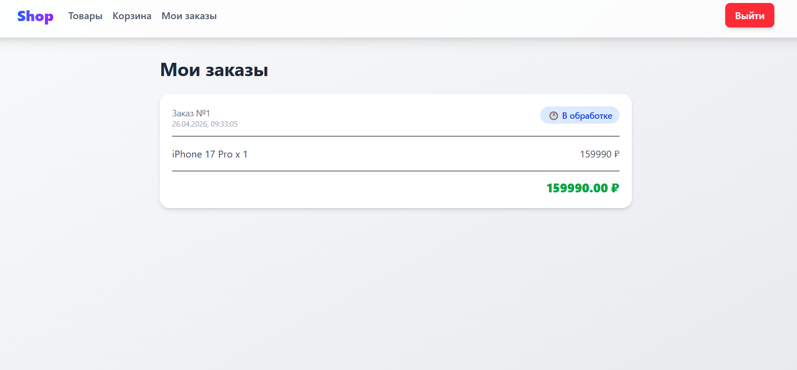
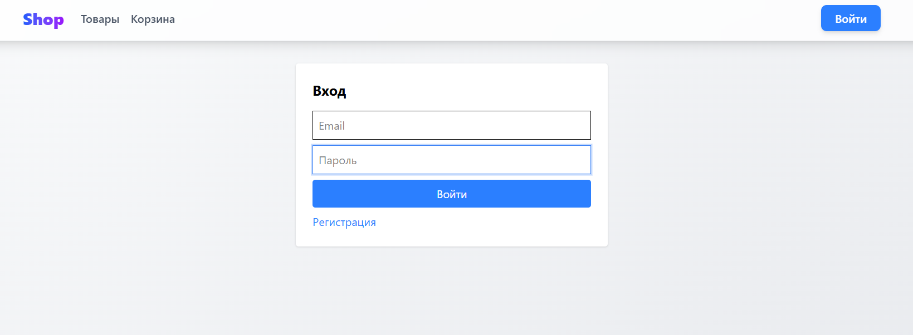
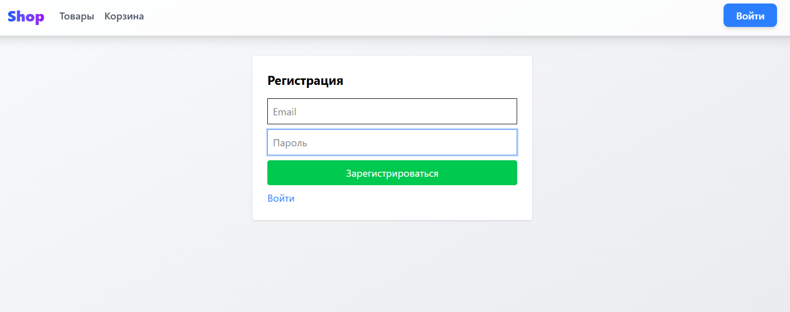

# Мини интернет-магазин

Full-stack приложение на NestJS + React + Prisma + PostgreSQL.

## Возможности

- 🔐 Регистрация и вход (JWT-токены)
- 👤 Роли: администратор и пользователь
- 🛍️ Каталог товаров с поиском и фильтрацией по названию, категории, цене
- 🛒 Корзина на сервере (добавление, удаление, изменение количества)
- 📦 Оформление заказа с адресом, телефоном и комментарием
- 📋 История заказов пользователя
- ⚙️ Админ-панель: добавление, редактирование, удаление товаров
- 🖼️ Загрузка изображений товаров
- 🎨 Адаптивный дизайн на TailwindCSS
- ✨ Анимации кнопок и плавные переходы

## Технологии

| Бэкенд | Фронтенд |
|--------|----------|
| NestJS | React |
| TypeScript | TypeScript |
| Prisma ORM | Redux Toolkit |
| PostgreSQL | TailwindCSS |
| JWT (Passport.js) | Axios |
| Multer (загрузка файлов) | React Router |

## Скриншоты

## Установка и запуск

### Требования
- Node.js 18+
- PostgreSQL

### Бэкенд
cd server
npm install
npx prisma migrate dev --name init
npm run start:dev

### Фронтенд
cd client
npm install
npm run dev

## Автор
Азизов Шариф
